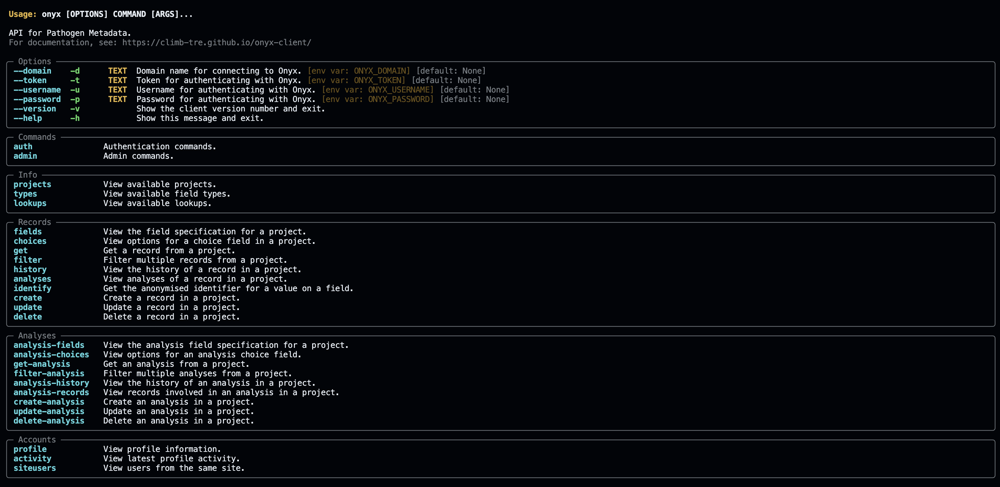

---
hide:
  - navigation
---

# Onyx-client

## Introduction

This site documents [Onyx-client](https://github.com/CLIMB-TRE/onyx-client), a program that provides a command-line interface and Python API for interacting with the [Onyx](https://github.com/CLIMB-TRE/onyx/) database.

Onyx is being developed as part of the [CLIMB-TRE](https://climb-tre.github.io/) project. 



## Installation

### Install from conda-forge (recommended)

```
$ conda create --name onyx --channel conda-forge climb-onyx-client
```

This installs the latest version of the Onyx-Client from [conda-forge](https://anaconda.org/conda-forge/climb-onyx-client).

### Install from PyPI

```
$ pip install climb-onyx-client
```

This installs the latest version of the Onyx-Client from [PyPI](https://pypi.org/project/climb-onyx-client/).

### Build from source

Download the source code from Github:

```
$ git clone https://github.com/CLIMB-COVID/onyx-client.git
```

Run installation from within the source code directory:

```
$ cd onyx-client/
$ pip install .
```

## Accessibility

### Enable/disable colours in the command-line interface

Colours are enabled by default in the output of the command-line interface. To disable them, create an environment variable `ONYX_COLOURS` with the value `NONE`:

```
$ export ONYX_COLOURS=NONE
```


To re-enable colours, unset the environment variable:

```
$ unset ONYX_COLOURS
```